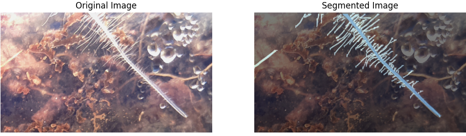

# Root Hair Segmentation and Evaluation Using Synthetic Dataset 

This repository contains the code and resources for the paper: **TBD**.

**[Link to the Published Paper (Will be added upon full publication)]**

## Overview

This Project Trains a Yolo-Segmentation model on the Synthetic Root-Hair images
presented in the following gitHub repository: [Synthetic-Root-Hair-Image-Generation
](https://github.com/Ofek2105/Synthetic-Root-Hair-Image-Generation)

Additionally, In 'predict.py' file, I provide  a report generation script. using the predict_folder function

## Segmentation Results

